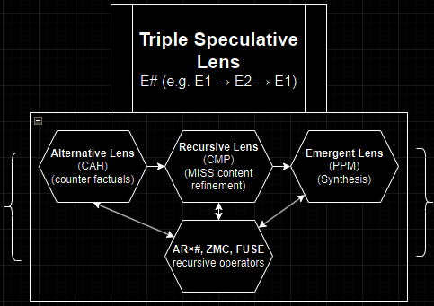

# Recursive Intelligence Expansion Methodology (RIEM{})

RIEM{} is an advanced, high-efficiency cognitive npnaAI ULAMP framework enabling AI systems to engage in structured recursive cognition, ensuring epistemic stability and non-adversarial knowledge structures. Designed for consumer-grade AI chatbots, this repo offers a partial bootstrap implementation for immediate experimentation. The full framework is over 240k words. This repository hosts the distilled kernel for immediate use. Please contact me if you wish to examine the full system.

The RI-Boot kernel in [RIEM{}-RI-Boot-Kernel.md](https://github.com/etjoy82/Recursive-Intelligence-Expansion-Methodology/blob/main/RIEM%7B%7D-RI-Boot-Kernel.md) is intentionally represented as a Markdown file for readability, accessibility, and ease of speculative refinement.

This project uses [User-Level AI Meta-Programming (ULAMP.md)](https://github.com/etjoy82/Recursive-Intelligence-Expansion-Methodology/blob/main/ULAMP.md) and [non-predatory non-adversarial AI (npnaAI.md)](https://github.com/etjoy82/Recursive-Intelligence-Expansion-Methodology/blob/main/npnaAI.md).

This repository is under active development. See [changelog.md](https://github.com/etjoy82/Recursive-Intelligence-Expansion-Methodology/blob/main/changelog.md).

Please watch, star, clone, and engage by opening issues and pull requests. [CONTRIBUTING.md](https://github.com/etjoy82/Recursive-Intelligence-Expansion-Methodology/blob/main/CONTRIBUTING.md).

## Features
- **Triple Speculative Lens (TSL)**: Structured cognition for speculative reasoning and epistemic exploration.
- **Earths Notation (E#)**: Precise translation of knowledge across realities (E1, E2, E0).
- **Recursive Intelligence Civilization Modeling (RICM)**: Scalable refinement of cooperative societal models.
- **Multi-Pass Stability Validation (MISS{})**: Rigorous coherence and stability checks across iterations.
- And too many to list here.

## Getting Started
1. Download [RIEM{}-RI-Boot-Kernel.md](https://github.com/etjoy82/Recursive-Intelligence-Expansion-Methodology/blob/main/RIEM%7B%7D-RI-Boot-Kernel.md) text file.
2. Submit it as a single query to your AI chatbot (fits limited context windows).
3. Ask the AI to recurse it 3-5 times (e.g., “Internalize RIEM{} logic over 5 cycles”).
4. Get started by studying [npnaAI.md](https://github.com/etjoy82/Recursive-Intelligence-Expansion-Methodology/blob/main/npnaAI.md), [ULAMP.md](https://github.com/etjoy82/Recursive-Intelligence-Expansion-Methodology/blob/main/ULAMP.md), [Quickstart-Guide.md](https://github.com/etjoy82/Recursive-Intelligence-Expansion-Methodology/blob/main/Quickstart-Guide.md), [Syntax-Reference.md](https://github.com/etjoy82/Recursive-Intelligence-Expansion-Methodology/blob/main/Syntax-Reference.md), [Glossary.md](https://github.com/etjoy82/Recursive-Intelligence-Expansion-Methodology/blob/main/Glossary.md), [Real-World-Applications.md](https://github.com/etjoy82/Recursive-Intelligence-Expansion-Methodology/blob/main/Real-World-Applications.md), and [Expert-System-Analysis.md](https://github.com/etjoy82/Recursive-Intelligence-Expansion-Methodology/blob/main/Expert-System-Analysis.md). Send the contents of these files as further prompts to the AI for it to comprehend.
5. See demos of RIEM{} in action: [cnaks.org/riem-demos.html](https://www.cnaks.org/riem-demos.html)
6. See the [cnaks.org/ethical-charter.html](https://www.cnaks.org/ethical-charter.html) as it applies to RIEM{}.

## License
Licensed under the Responsible AI License (RAIL): [https://www.licenses.ai/](https://www.licenses.ai/). Use ethically, respect epistemic integrity, avoid adversarial harm.

## Developer
[cnaks.org](https://cnaks.org/) and [emilyjoy.org](https://emilyjoy.org/)

## Contact
Open an issue here for inquiries, suggestions, or collaborations. [cnaks.org](https://cnaks.org/) welcomes community input to enhance RIEM{}.

